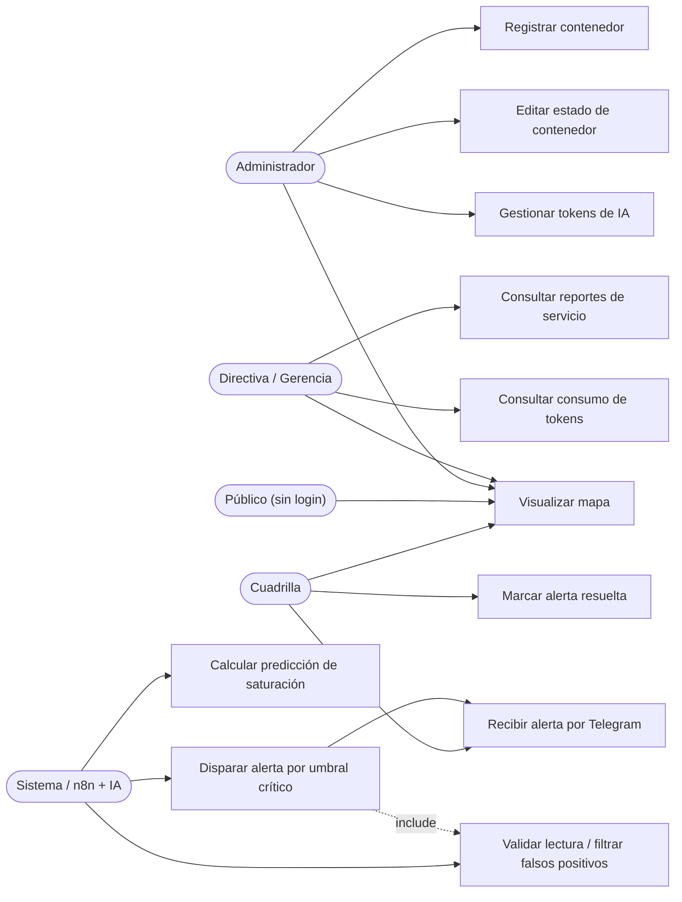
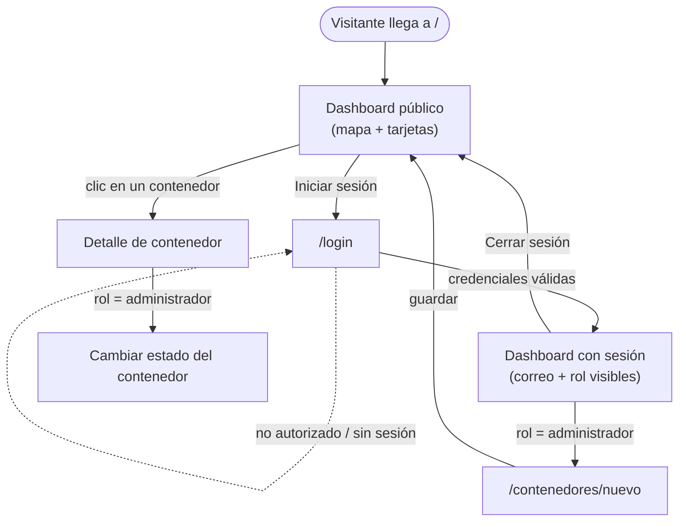
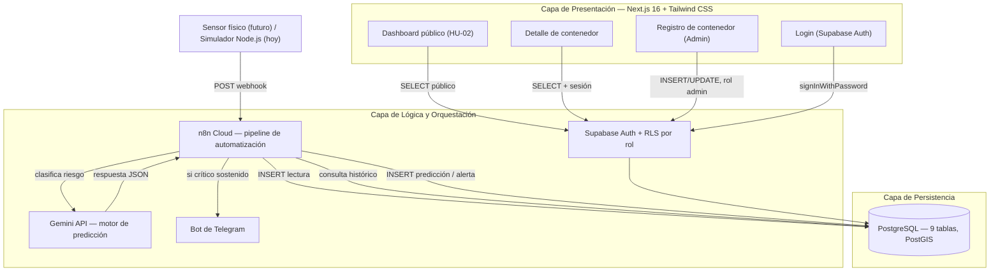
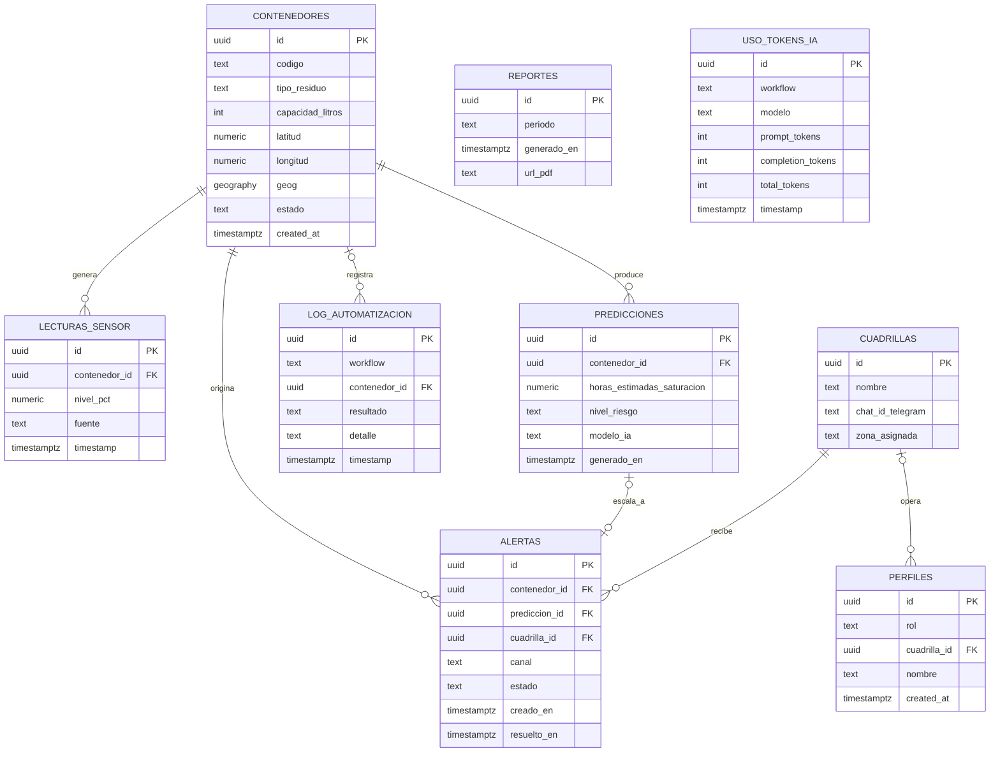

República Bolivariana de Venezuela\
Universidad Nacional Experimental de Guayana\
Vicerrectorado Académico\
Asignatura: Ingeniería de Software I\
Proyecto de Carrera: Ingeniería en Informática

# INFORME DE AVANCE DEL PROYECTO

SIMDES — Sistema Inteligente de Monitoreo y Predicción de Desechos Sólidos

**Profesora:**\
Ing. Dubraska Roca

**Estudiante:**\
Guédez, Johanna / C.I.: V-14.089.807

Ciudad Guayana, Venezuela\
11 de septiembre de 2026

> **Nota sobre esta versión.** Este documento es la versión final consolidada del informe, redactada en Markdown a partir de: (1) el contenido base verificado el 11/09 (`docs/INFORME-AVANCE-ACTUALIZADO-11-09.md`, ya con sus 3 correcciones aplicadas tras verificación directa contra el código y la base de datos), (2) los entregables oficiales y el baremo de la cátedra (`docs/CONTEXTO-ACADEMICO.md`), y (3) patrones de organización adoptados de un proyecto de referencia distinto (chatbot/sistema de tickets), reestructurados para el dominio real de SIMDES. No se inventó ninguna cifra ni resultado: donde falta un dato verificado, se declara explícitamente como pendiente en vez de estimarlo. Los diagramas de esta versión se expresan en Mermaid (bloques de código que GitHub renderiza de forma nativa); si la entrega final requiere imágenes estáticas para un documento no-Markdown, deben exportarse aparte — ver nota en la sección 11.

## Índice

1. Proceso de Elicitación de Requisitos
2. Requerimientos Funcionales y No Funcionales
3. Historias de Usuario
4. Gestión del Control de la Calidad del Software
5. Diagramas de Caso de Uso
6. Uso de Inteligencia Artificial en el Proyecto
7. Prototipo UI/UX
8. Arquitectura General de la Aplicación
9. Arquitectura de la Base de Datos
10. Arquitectura de Automatizaciones (n8n)
11. Evidencia del Proyecto
12. Gestión de Consumo de Tokens de IA
13. Conclusiones y Próximos Pasos

---

## Introducción

La gestión de desechos sólidos en Ciudad Guayana —como en la mayoría de las ciudades venezolanas— sigue operando bajo un modelo reactivo: las cuadrillas de aseo urbano recorren rutas y horarios fijos, sin ningún dato real sobre cuánto residuo hay acumulado en cada punto limpio o papelera pública en un momento dado. El resultado es previsible: contenedores que rebosan días antes de que pase la ruta programada, vertederos espontáneos en las aceras, focos sanitarios agravados por el clima tropical, y cuadrillas que terminan recorriendo puntos casi vacíos mientras otros, saturados, quedan sin atender. Ese es exactamente el Problema N.° 9 asignado por la cátedra: la incapacidad de prever cuándo un contenedor alcanzará su capacidad máxima.

**SIMDES** (Sistema Inteligente de Monitoreo y Predicción de Desechos Sólidos) ataca ese problema reemplazando la suposición por el dato. Cada contenedor reporta su nivel de llenado; un modelo de inteligencia artificial (Google Gemini) proyecta, a partir del histórico de lecturas, cuántas horas faltan para su saturación; y un flujo de automatización construido en n8n despacha la alerta directamente a la cuadrilla asignada por Telegram en cuanto se cruza el umbral crítico, sin que nadie tenga que revisar reportes al final del día. La plataforma se construye sobre Next.js, Supabase (PostgreSQL) y Vercel, con un mapa geoespacial en tiempo real como interfaz principal para el coordinador de servicios públicos.

El proyecto se delimita como un piloto urbano escalable: un circuito inicial de puntos limpios en un sector mixto —comercial y residencial— de Ciudad Guayana (Municipio Caroní), sobre una arquitectura modular que permite extender la cobertura al resto del municipio una vez validada su viabilidad técnica y operativa. **A la fecha de este informe (11/09), el sistema funciona de punta a punta en sus flujos centrales:** mapa interactivo con 20 contenedores reales, flujo de automatización n8n validado end-to-end (predicciones y alertas reales por Telegram), seguridad de base de datos verificada y corregida, y autenticación con modelo de roles construida y funcionando. Lo que resta —detallado en la sección 13— es completar los paneles de reportes, tomar la evidencia visual (capturas y video) y el pulido de interfaz final.

## Planteamiento del Problema

A nivel internacional, la gestión de desechos sólidos urbanos opera bajo esquemas de recolección de rutas y frecuencias fijas, que asumen una generación de residuos homogénea y predecible cuando en realidad es dinámica. Esta desarticulación genera altos costos operativos y la incapacidad de prever cuándo un punto limpio o papelera pública alcanzará su capacidad máxima, ocasionando acumulación de basura en la vía pública — el Problema N.° 9 asignado por la cátedra.

En el contexto de Ciudad Guayana (Municipio Caroní), este colapso se agrava por cinco factores propios de la realidad operativa local. Primero, una asimetría territorial en la recolección: la escasez de combustible y una flota de camiones compactadores reducida llevan a las empresas de aseo a priorizar los corredores comerciales, desatendiendo durante semanas las calles internas de las urbanizaciones. Segundo, la generación de vertederos espontáneos en avenidas, cuando los residentes trasladan su basura hacia las esquinas y frentes comerciales ante la falta de recolección en sus viviendas. Tercero, una aceleración sanitaria propia del clima tropical, que pudre los desechos orgánicos en menos de 24 horas y genera lixiviados, vectores y malos olores. Cuarto, la vulnerabilidad del hardware instalado en la vía pública ante el hurto y el vandalismo. Y quinto, los falsos positivos mecánicos: un sensor óptico simple se deja engañar por bolsas infladas o cartón atascado en la boca del contenedor, reportando saturación cuando aún hay capacidad disponible.

### Contexto Institucional: la Crisis del Servicio de Aseo Urbano

Estos cinco factores no ocurren en el vacío: responden a una crisis institucional concreta del servicio de aseo urbano en el municipio. Hasta diciembre de 2025, la recolección estuvo a cargo de Fospuca, empresa privada concesionaria; su salida del municipio —reportada en prensa local y redes sociales como una combinación de quiebra financiera y disputas por las tarifas cobradas a locales comerciales por metro cuadrado— derivó en la rescisión unilateral del contrato ese mes, decisión atribuida a la Gobernación del Estado Bolívar, encabezada por la Gobernadora Yulisbeth García. La recolección fue reasignada a **SupraGuayana S.A.** (Sistema Urbano de Procesamiento y Recolección de Aseo de Guayana), un ente que ya había operado el servicio años atrás bajo la administración del entonces alcalde Tito Oviedo (Alcaldía de Caroní) y que ahora opera bajo tutela de la Gobernación en lugar de la alcaldía. Según un volante de asignación de rutas distribuido por el nuevo operador entre los vecinos, la frecuencia actual de recolección es de una vez por semana en zonas residenciales e interdiaria en zonas comerciales.

*Nota metodológica: estos datos institucionales provienen de fuentes secundarias —prensa local, redes sociales y un volante oficial de asignación de rutas— recopiladas por la autora del proyecto como contexto motivacional; no constituyen una verificación independiente y se presentan con ese alcance.*

Contrastada con el dato ya establecido de que la materia orgánica se descompone en menos de 24 horas bajo el clima tropical de la región, una frecuencia de recolección semanal en zonas residenciales garantiza, de por sí, varios días de acumulación y descomposición activa en cada punto limpio, independientemente de cualquier mejora tecnológica. SIMDES no puede resolver esa causa raíz —de naturaleza institucional y presupuestaria—, pero sí puede maximizar la eficiencia de la capacidad de recolección que sí existe: dirigiendo a las cuadrillas, dentro del esquema de frecuencias que la gobernación defina, hacia los puntos que real y objetivamente lo requieren primero, en lugar de operar a ciegas.

### Consecuencias Sanitarias y Ambientales

La acumulación prolongada de desechos en la vía pública no es solo un problema estético u operativo: tiene consecuencias sanitarias directas sobre la ciudadanía. Los residuos orgánicos en descomposición atraen roedores y aves carroñeras (zamuros), vectores asociados a enfermedades como leptospirosis y afecciones gastrointestinales; los lixiviados contaminan suelo y fuentes de agua cercanas; y la acumulación de agua estancada en envases y bolsas favorece la proliferación de mosquitos vectores de dengue. Este componente de salud pública es, junto con el operativo, parte de la motivación del proyecto: un sistema de alerta temprana no solo optimiza rutas, sino que reduce el tiempo de exposición de la comunidad a estos focos.

### Delimitación Geográfica del Piloto

El Municipio Caroní está dividido oficialmente en 11 parroquias, según la Alcaldía de Caroní: en el sector Puerto Ordaz (margen oeste del río Caroní) las parroquias Unare, Universidad y Cachamay; en el sector San Félix (margen este) las parroquias Dalla Costa, Simón Bolívar, 11 de Abril, Chirica y Vista al Sol; y tres parroquias rurales (Pozo Verde, Yocoima y 5 de Julio).

Frente a esta realidad, SIMDES se delimita como un **proyecto piloto urbano escalable**: un circuito inicial de puntos limpios en la **Parroquia Universidad** (sectores Alta Vista Norte y Sur, Los Olivos, Villa Asia), la parroquia cuya propia caracterización oficial la describe como zona de uso mixto —"concentra importantes zonas residenciales y comerciales"—, lo que la hace representativa del patrón de vertedero espontáneo descrito arriba sin sesgar el piloto hacia un extremo puramente residencial o puramente comercial. Sobre una arquitectura modular en la nube, el sistema puede extenderse progresivamente a las 10 parroquias restantes del municipio una vez validada su viabilidad técnica en este sector piloto.

**A la fecha de este informe, el piloto cuenta con 4 puntos reales georreferenciados** (Los Olivos: 8.28511, -62.71360; Alta Vista Norte: 8.29200, -62.72100; Alta Vista Sur: 8.27800, -62.71800; Villa Asia: 8.28900, -62.70600), cada uno con 4 contenedores —uno por tipo de residuo, según la norma COVENIN 3838— más 4 contenedores de prueba originales, para un total de **20 contenedores reales en base de datos**. El código de cada contenedor codifica su tipo por color oficial: `Y` = Amarillo → plástico, `A` = Azul → papel, `V` = Verde → vidrio, `M` = Marrón → orgánico (p. ej. `PL-001-Y`).

*Nota: la división parroquial citada corresponde a la organización político-territorial oficial de la Alcaldía de Caroní; los sectores y urbanizaciones mencionados dentro de cada parroquia siguen la nomenclatura de uso común (cartografía y registros municipales), no un levantamiento catastral propio.*

### Análisis Competitivo: SIMDES frente a Soluciones Existentes

Durante la revisión de soluciones similares se identificó Sortyx, un contenedor inteligente con pantalla táctil integrada y panel de analítica corporativa, orientado a espacios interiores supervisados —oficinas y centros comerciales— donde el contenedor forma parte del mobiliario y del recorrido de usuarios internos, y el vandalismo o el hurto no son un riesgo relevante. Ese enfoque es correcto para su contexto, pero es inverso al de SIMDES: el Problema N.° 9 ocurre en la vía pública, sin supervisión, con exposición directa a intemperie, hurto y vandalismo.

|  | Sortyx | SIMDES |
| --- | --- | --- |
| Ambiente | Interiores controlados (oficinas, centros comerciales) | Espacios públicos urbanos, sin supervisión |
| Hardware | Contenedor físico completo con pantalla táctil | Módulo sensor compacto sobre contenedor existente |
| Costo por unidad | ~500 a 2.000 USD (referencial, no verificado) | ~25 a 40 USD (ver Modelo de Viabilidad) |
| Clasificación | Por tipo de residuo, con cámara e IA visual | Por nivel de llenado, con sensor ultrasónico |
| Riesgo físico asumido | Ninguno (entorno controlado) | Hurto y vandalismo (diseño antivandálico embebido) |

Por eso el diseño de hardware de SIMDES —definido desde la planificación inicial del proyecto— privilegia un sensor discreto, económico y embebido dentro del contenedor existente, sin pantalla ni componentes expuestos, que reporta su lectura a un dashboard remoto en lugar de mostrarla localmente. Esta comparación no cambia el diseño ya adoptado; lo confirma como la decisión correcta para el entorno del problema asignado.

Lo único que SIMDES sí adopta de la referencia visual de Sortyx es la estética del dashboard —no el hardware ni el modelo de negocio—: tema oscuro, gráficas de anillo (*donut*) para el nivel de llenado agregado, gráfica de tendencia diaria y barra lateral de navegación. Esa dirección visual se retoma en la sección 7 (Prototipo UI/UX).

### Modelo de Viabilidad y Sostenibilidad (Propuesta)

SIMDES es, en su núcleo, una aplicación web progresiva (PWA): un panel de monitoreo y alertas al que el coordinador de servicios públicos y las cuadrillas acceden desde el navegador de un computador o teléfono, sin necesidad de instalar nada desde una tienda de aplicaciones. El proyecto no fabrica contenedores: la propuesta es instrumentar con sensores los puntos limpios y papeleras públicas ya existentes en el municipio, lo que reduce significativamente la barrera de entrada frente a un despliegue que requiriera mobiliario urbano nuevo.

Este enfoque no es una construcción puramente teórica: en despliegues documentados de gestión inteligente de residuos —Barcelona (sensores ultrasónicos para optimizar rutas de recolección), la Agencia Nacional del Ambiente de Singapur (red de contenedores inteligentes a escala nacional), Helsinki, y los contenedores solares Bigbelly instalados en Nueva York y Londres— el canal dominante es la contratación pública municipal, no la venta directa al ciudadano; el valor comercial no reside en el sensor en sí, sino en el servicio de datos y optimización de rutas que genera para el operador. SIMDES se alinea con ese mismo patrón de adopción. **Este modelo de adopción es, además, la base del análisis de stakeholders que fundamenta el modelo de roles de acceso** desarrollado en la sección 3 y 5 de este informe.

Para que un piloto público de este tipo sea viable en el contexto venezolano actual —donde este ecosistema aún no existe— se proponen, con carácter de propuesta y no de acuerdo ya suscrito, tres frentes de trabajo: primero, un aliado institucional operativo, natural pero no exclusivamente el ente de aseo urbano vigente (SupraGuayana) o la Gobernación, bajo un esquema de piloto público-privado en el que el sector académico documenta y desarrolla, y el ente público autoriza la instalación en su mobiliario; segundo, el suministro de los sensores, que podría explorarse como manufactura local a pequeña escala —una oportunidad de generación de empleo técnico en la región— antes que como importación, dado el componente relativamente simple del sensor (ultrasónico o infrarrojo más un módulo de conectividad); y tercero, un modelo de sostenibilidad económica basado en contrato de servicio con el ente operador (pago por optimización de rutas y reducción de kilometraje/combustible) más, a mediano plazo, la venta de datos agregados de generación de residuos a fines de planificación urbana. Ninguno de estos tres frentes cuenta hoy con un acuerdo real; se documentan aquí como la hoja de ruta de viabilidad que el proyecto debería recorrer para dejar de ser un piloto académico y convertirse en un servicio sostenido.

**Estimación de costos del módulo sensor (SIMDES-Node), a precio de componente:**

| Componente | Costo aproximado | Función |
| --- | --- | --- |
| Sensor ultrasónico HC-SR04 | ~3 USD | Medición de distancia / nivel de llenado |
| Microcontrolador ESP32 + módulo SIM 4G | ~15 USD | Procesamiento local y transmisión de datos |
| Batería LiSOCl2 | incluido | Autonomía de 3 a 5 años sin recarga |
| Carcasa IP68 + resina antivandálica | incluido | Resistencia a intemperie, hurto y vandalismo |
| **Total estimado por unidad** | **25 a 40 USD** | Ensamblaje localizable en Ciudad Guayana |

Esta cifra es una estimación de componente a precio de catálogo, no una cotización real de proveedor; se documenta para dar magnitud a la propuesta, no como compromiso de costo.

**Fases de implementación propuestas:**

| Fase | Alcance | Plazo | Costo |
| --- | --- | --- | --- |
| 1. Piloto digital (este proyecto) | Solo software, datos simulados o ingresados manualmente por SupraGuayana, en la Parroquia Universidad | Actual | Vercel + Supabase, plan gratuito: 0 USD/mes |
| 2. Piloto con hardware básico | 10 a 20 módulos sensor en la Parroquia Universidad | 6 a 12 meses | ~500 a 800 USD en hardware; financiamiento a explorar (Gobernación, empresa privada local) |
| 3. Escalamiento municipal | Red de sensores en las 11 parroquias del Municipio Caroní; posible alianza de fabricación local | 2 a 3 años | Modelo SaaS municipal (licencia recurrente a la Gobernación); exportable a otras ciudades venezolanas |

Como en el resto de este apartado, ninguna de las tres fases cuenta con financiamiento o acuerdo confirmado: es la ruta de escalamiento que el proyecto debería recorrer, no un plan ya en ejecución. **Ninguna de estas fases justifica hoy una distinción de roles entre "administrador de SIMDES" y "administrador municipal"** — el esquema actual no tiene multi-tenencia (no existe una columna tipo `municipio_id`), y una fase sin financiamiento confirmado no es un requisito real todavía (ver sección 3, análisis de roles).

## Objetivos del Proyecto

### Objetivo General

Desarrollar una plataforma web progresiva para el monitoreo en tiempo real y la predicción del estado de llenado en puntos limpios de desechos sólidos, integrando modelos de inteligencia artificial y flujos de automatización para la optimización de rutas de recolección municipal bajo estándares de ingeniería de software.

### Objetivos Específicos

1. Formular la especificación formal de requerimientos funcionales, no funcionales y criterios de aceptación en sintaxis Gherkin BDD, considerando restricciones físicas de bajo costo y protección antivandálica.
2. Diseñar el modelo de datos relacional en PostgreSQL mediante Supabase y la interfaz de usuario en Next.js con Tailwind CSS para la representación geoespacial del estado de los contenedores.
3. Implementar un módulo de procesamiento predictivo basado en inteligencia artificial que estime el tiempo restante hasta la saturación del contenedor según el historial de llenado.
4. Construir flujos de trabajo automatizados en n8n que procesen eventos de umbral crítico y despachen notificaciones operativas hacia el personal de recolección vía Telegram.
5. Evaluar la calidad del producto software bajo las características de Inocuidad (Safety), Fiabilidad y Seguridad establecidas en el estándar ISO/IEC 25010:2023.
6. Implementar control de acceso basado en roles (RBAC), fundamentado tanto en las historias de usuario del backlog como en el modelo de negocio real del proyecto (contratación pública municipal).

---

# 1. Proceso de Elicitación de Requisitos

## 1.1 Definición y Objetivo

El levantamiento de requisitos de SIMDES tiene como objetivo traducir el Problema N.° 9 asignado por la cátedra —incapacidad de prever la saturación de un punto limpio— en un conjunto de requerimientos verificables, historias de usuario priorizadas y un modelo de datos capaz de sostenerlos, considerando desde el inicio las restricciones reales del contexto de Ciudad Guayana (ver Planteamiento del Problema).

## 1.2 Técnicas de Elicitación Aplicadas

### 1.2.1 Revisión Formal del Enunciado del Problema

Análisis del Problema N.° 9 tal como fue asignado por la cátedra, identificando el vacío central: ausencia de visibilidad en tiempo real sobre el nivel de llenado de los puntos limpios.

### 1.2.2 Investigación Contextual Local

Se documentaron cinco factores determinantes del contexto operativo real de Ciudad Guayana (Municipio Caroní) —asimetría territorial, vertederos espontáneos, aceleración sanitaria, vulnerabilidad del hardware y falsos positivos mecánicos— junto con el contexto institucional de la crisis del servicio de aseo (transición Fospuca → SupraGuayana) y sus consecuencias sanitarias y ambientales, desarrollados en el Planteamiento del Problema de este informe.

### 1.2.3 Análisis Competitivo

Revisión de Sortyx, contenedor inteligente con pantalla orientado a espacios interiores supervisados, para confirmar que el diseño de hardware de SIMDES —sensor discreto sin pantalla, propio de un entorno público no supervisado— responde correctamente al Problema N.° 9.

### 1.2.4 Elicitación Asistida por IA

Se empleó un prompt formal para estructurar los requisitos considerando de forma explícita las restricciones físicas y normativas identificadas. El texto literal de ese prompt corresponde a una fase anterior del proyecto (previa a esta sesión de Claude Code) y no está disponible dentro del contexto de quien redacta esta versión del informe — **pendiente de recuperar del historial de la sesión original** para citarlo textualmente en la sección 6.3 (Prompts Utilizados). Sí se documentan textualmente en esa sección los prompts reales usados el 11/09, verificables en esta misma conversación.

### 1.2.5 Delimitación del Alcance

A partir de lo anterior, el proyecto se acotó a un **piloto urbano escalable**: un circuito inicial de puntos limpios en la Parroquia Universidad (Municipio Caroní) —la única de las 11 parroquias caracterizada oficialmente como de uso mixto, residencial y comercial—, con arquitectura modular en la nube que permite extender el sistema progresivamente a las 10 parroquias restantes del municipio una vez validada su viabilidad técnica.

## 1.3 Resultados de la Elicitación

**Nota metodológica — cliente hipotético.** La elicitación toma a SupraGuayana S.A. como stakeholder primario y cliente hipotético del sistema: los requerimientos, historias de usuario y criterios de aceptación de este informe se formulan como si SIMDES fuera a entregarse a su Dirección de Servicios Públicos. En un escenario real, esta propuesta se presentaría formalmente a esa dirección o a la Gobernación del Estado Bolívar; el proyecto no cuenta hoy con un contrato o acuerdo real con ninguna de las dos.

El resultado directo de este proceso es el conjunto de 7 Historias de Usuario del Product Backlog (sección 3), los 7 Requerimientos Funcionales y 7 No Funcionales (sección 2), y —como resultado adicional no previsto en la planificación original— el modelo de 4 roles de acceso (sección 3.7 y 5.1), que amplía el análisis de stakeholders más allá del backlog funcional hacia el modelo de negocio real del proyecto.

## 1.4 Validación

Al tratarse de un cliente hipotético (SupraGuayana S.A. no ha revisado ni aprobado formalmente ningún artefacto de este proyecto), **no existe una validación externa con un stakeholder real**. La validación aplicada fue interna e iterativa: contraste continuo de cada requisito y cada decisión de alcance contra (a) el enunciado literal del Problema N.° 9, (b) el baremo de evaluación de 10 criterios de la cátedra, y (c) el estado real y verificado del sistema en cada corte de avance — esta última verificación, ejecutada el 11/09, encontró y corrigió 3 afirmaciones que no correspondían con el estado real del sistema (ver sección 4.6), lo que en sí mismo es evidencia de que el proceso de validación interno está funcionando, no solo declarado.

---

# 2. Requerimientos Funcionales y No Funcionales

## 2.1 Requerimientos Funcionales

| ID | Requerimiento | Historia de Usuario |
| --- | --- | --- |
| RF-01 | Registrar y georreferenciar contenedores con código, tipo de residuo y capacidad | HU-01 |
| RF-02 | Visualizar en un mapa el nivel de llenado de cada contenedor mediante semáforo de color (verde <50%, amarillo 50–84%, rojo ≥85%) | HU-02 |
| RF-03 | Validar cada lectura entrante y descartar picos momentáneos que no se sostengan 20 minutos reales (filtro anti-falsos positivos) | HU-03 |
| RF-04 | Calcular, mediante IA, la hora estimada de desbordamiento según la tasa histórica de llenado | HU-04 |
| RF-05 | Despachar automáticamente una notificación por Telegram a la cuadrilla asignada cuando un contenedor supera el umbral crítico | HU-05 |
| RF-06 | Exportar resúmenes periódicos de vaciados y tiempos de atención | HU-06 |
| RF-07 | Registrar el consumo de tokens de cada llamada a la IA, para control de costos operativos | HU-07 |

## 2.2 Requerimientos No Funcionales

Formulados bajo el marco ISO/IEC 25010:2023 que rige la calidad del proyecto (sección 4):

| ID | Característica ISO 25010 | Requisito medible |
| --- | --- | --- |
| RNF-01 | Inocuidad (Safety) | Prevención de riesgo biológico por desbordamiento orgánico no detectado |
| RNF-02 | Eficiencia de desempeño | Tiempo de respuesta del mapa web < 1 segundo (**pendiente de medición formal** — no se ha corrido una prueba de carga/lighthouse documentada aún) |
| RNF-03 | Fiabilidad | Tolerancia a fallos de sensores mediante predicción basada en histórico, no en lectura única |
| RNF-04 | Seguridad | Credenciales y firmas criptográficas de los webhooks fuera del código fuente (archivo `.env`); acceso de escritura restringido por rol autenticado (RLS + Supabase Auth) |
| RNF-05 | Mantenibilidad | Código organizado por componentes, con historial de commits trazable en GitHub |
| RNF-06 | Capacidad de interacción | Un usuario nuevo identifica el estado de un contenedor sin explicación adicional, por color |
| RNF-07 | Control de acceso | Separación de funciones por rol (Administrador, Directiva, Cuadrilla) según el principio de mínimo privilegio (sección 3.7) |

## 2.3 Matriz de Trazabilidad

Traza cada requisito a su Historia de Usuario, su estado real de implementación y la evidencia verificable disponible a la fecha de este informe.

| Requisito | HU | Estado real (11/09) | Evidencia verificable |
| --- | --- | --- | --- |
| RF-01 | HU-01 | ✅ Implementado | 20 contenedores reales en `contenedores`; formulario `/contenedores/nuevo` con mapa clicable, protegido por rol Administrador |
| RF-02 | HU-02 | ⚠️ Parcial | Mapa funcionando con semáforo de color; **falta agrupar por punto** (hoy un marcador por contenedor, no por ubicación) |
| RF-03 | HU-03 | ✅ Implementado y corregido | 3 bugs de n8n encontrados y corregidos el 11/09 (sección 10.4); verificado con una racha real de 11.8 min que correctamente NO disparó alerta |
| RF-04 | HU-04 | ✅ Implementado | 20 predicciones reales generadas en la corrida de prueba del 11/09; confirmado legible por la app tras corregir el bug de RLS (sección 4.6) |
| RF-05 | HU-05 | ✅ Implementado | 5 alertas reales entregadas por Telegram (`canal = 'telegram'`) en la misma corrida |
| RF-06 | HU-06 | ❌ Pendiente | Tabla `reportes` existe y es legible (RLS corregido), pero sin pantalla ni proceso de generación |
| RF-07 | HU-07 | ⚠️ Parcial | 28 registros reales en `uso_tokens_ia` (6.613 tokens totales), tabla legible por la app; sin pantalla de reportes todavía |
| RNF-01 | — | ✅ Cubierto | Mismo flujo de RF-03/RF-05 (alerta antes del rebose) |
| RNF-02 | — | ❌ No medido | Sin prueba de rendimiento formal documentada |
| RNF-03 | — | ✅ Cubierto | RF-04, predicción basada en histórico de `lecturas_sensor`, no en lectura única |
| RNF-04 | — | ✅ Implementado | Supabase Auth + tabla `perfiles` + RLS por rol (sección 4.6, 9.4) |
| RNF-05 | — | ✅ Cubierto | Historial de commits + bitácora técnica sesión a sesión en el repositorio |
| RNF-06 | — | ⚠️ Sin evidencia visual todavía | Diseño por color implementado; falta captura/prueba de usuario real |
| RNF-07 | — | ✅ Implementado | Modelo de 4 roles (sección 3.7) + políticas RLS diferenciadas por rol |

---

# 3. Historias de Usuario

## 3.1 Formato y Políticas de Calidad Ágil

El Product Backlog completo consta de 7 historias, estimadas en Story Points bajo escala Fibonacci (1, 2, 3, 5, 8) y organizadas en 3 Sprints. Formato: **Como** [rol] / **Quiero** [funcionalidad] / **Para** [beneficio], con criterios de aceptación en sintaxis Given-When-Then (Gherkin BDD).

**Definition of Ready (DoR):** formato estructurado; criterios de aceptación Gherkin; estimación acordada en Story Points; modelo de tablas validado en PostgreSQL/Supabase.

**Definition of Done (DoD):** código fuente en ramas de Git bajo principios SOLID; interfaz responsive en Next.js + Tailwind sin errores en consola; pruebas unitarias con cobertura mínima del 80% (decisión de alcance pendiente de confirmar según el tiempo disponible — no es un criterio explícito del baremo oficial de 10 puntos); despliegue automático operativo en Vercel; base de datos documentada.

## 3.2 Historias de Usuario — Actor: Administrador (técnico/operaciones)

### HU-01 — Registrar Puntos Limpios

**Como** coordinador de servicios públicos, **quiero** registrar puntos limpios con coordenadas GPS, tipo de desecho y capacidad, **para** mantener el inventario georreferenciado.

Módulo: Catálogo · SP: 3 · Sprint: 1 · **Estado: ✅ Creación con mapa clicable funcionando; edición de estado en `/contenedor/[id]` funcionando, protegida por rol Administrador vía RLS.**

### HU-07 — Gobierno de Tokens de IA (lado de escritura)

**Como** administrador, **quiero** registrar los tokens consumidos en cada inferencia, **para** garantizar eficiencia de costos.

Módulo: Gobierno IA · SP: 2 · Sprint: 3 · **Estado: ⚠️ Los datos ya se registran automáticamente en `uso_tokens_ia` (28 llamadas reales, ver sección 12); falta la pantalla de reportes.**

## 3.3 Historias de Usuario — Actor: Directiva / Gerencia

### HU-06 — Exportar Resúmenes de Gestión

**Como** director de servicios públicos, **quiero** exportar resúmenes semanales de vaciados, **para** auditar el rendimiento del servicio.

Módulo: Reportes · SP: 3 · Sprint: 3 · **Estado: ❌ Pantalla de reportes pendiente de construir.**

### HU-07 — Gobierno de Tokens de IA (lado de lectura)

La Directiva comparte esta historia con el Administrador, pero en modo **solo lectura** — ver justificación completa en la sección 3.7 (por qué este rol existe con un permiso distinto, no solo una HU distinta).

## 3.4 Historias de Usuario — Actor: Cuadrilla / Operador de Recolección

### HU-05 — Notificación Automática por Umbral Crítico (lado humano)

**Como** conductor de recolección, **quiero** recibir notificación automática por Telegram al superar el 85%, **para** ajustar mi recorrido.

Módulo: Automatización · SP: 3 · Sprint: 2 · **Estado: ✅ Alertas reales confirmadas por Telegram (5 alertas en la corrida de prueba del 11/09). ⚠️ Falta la acción de "marcar alerta resuelta" en la app — no existe la política de `UPDATE` en `alertas` ni la pantalla.**

**Especificación Gherkin de HU-05:**

```
Característica: Disparo de Alerta Inteligente por n8n
  Como Sistema de Gestión de Residuos
  Quiero enviar un mensaje con la orden de vaciado automático
  Para evitar que los desechos se desborden en la vía pública.

Escenario: Disparo de alerta al cruzar el umbral del 85%
  Dado que un contenedor supera el 85% de su capacidad sostenido 20 minutos reales
  Cuando la base de datos PostgreSQL emite el evento hacia n8n
  Entonces n8n solicita a la IA el cálculo del tiempo restante
  Y envía un mensaje por Telegram a la cuadrilla con la ubicación
  GPS y la ruta de recolección recomendada.
```

También usa el dashboard/mapa (HU-02, ver 3.6) para ubicar visualmente los puntos críticos de su zona.

## 3.5 Historias de Usuario — Actor: Sistema / Automatización (no humano)

### HU-03 — Validación de Lecturas

**Como** sistema, **quiero** validar lecturas descartando picos momentáneos (persistencia de 20 minutos reales), **para** evitar falsos positivos.

Módulo: Ingesta · SP: 3 · Sprint: 1 · **Estado: ✅ Corregido y validado con tiempo real de reloj — ver hallazgo de calidad en sección 4.6/10.4 (el filtro original contaba lecturas, no tiempo).**

### HU-04 — Predicción de Saturación

**Como** planificador de rutas, **quiero** que la IA calcule la hora estimada de desbordamiento, **para** programar el vaciado preventivo.

Módulo: IA · SP: 5 · Sprint: 2 · **Estado: ✅ Funcionando end-to-end (Gemini vía n8n); 20 predicciones reales generadas y confirmadas legibles por la app.**

HU-05 (disparo, no la recepción humana) también corresponde a este actor — ver 3.4.

## 3.6 Historia Transversal — HU-02 (todos los actores + público)

**Como** supervisor de aseo, **quiero** visualizar en un mapa interactivo el nivel de llenado por semáforo de colores, **para** identificar puntos críticos de forma inmediata.

Módulo: Dashboard · SP: 5 · Sprint: 1 · **Estado: ⚠️ Construido y funcionando (ícono de contenedor, semáforo de color), pero un marcador por contenedor, no agrupado por punto** — con 20 contenedores reales hoy se ven varios marcadores superpuestos por ubicación. Esta historia no pertenece a un solo actor: el dashboard/mapa es de **acceso público, sin login** (decisión de negocio confirmada — transparencia municipal), y lo usan tanto la Cuadrilla como la Directiva y el Administrador.

## 3.7 Resumen de Priorización

| Sprint | HU | SP | Estado (11/09) |
| --- | --- | --- | --- |
| 1 | HU-01 | 3 | ✅ |
| 1 | HU-02 | 5 | ⚠️ |
| 1 | HU-03 | 3 | ✅ |
| 2 | HU-04 | 5 | ✅ |
| 2 | HU-05 | 3 | ✅ (falta acción de cuadrilla) |
| 3 | HU-06 | 3 | ❌ |
| 3 | HU-07 | 2 | ⚠️ |

**Total: 24 Story Points.** 5 de 7 historias con implementación funcional confirmada; HU-02 con implementación parcial; HU-06 sin construir. HU-02, con 5 SP, es la de mayor peso del Sprint 1 — coherente con que exige mapa real, no solo tarjetas.

## 3.8 Modelo de Roles: Proceso de Definición y Justificación

**No estaba en la planificación original del backlog.** Se agregó el 11/09 tras un cuestionamiento fundamentado sobre el modelo de negocio real del proyecto (contratación pública municipal, sección "Modelo de Viabilidad"): si SIMDES se entrega a una alcaldía o gobernación, ¿no hace falta un rol para la directiva del ente de aseo, más allá de quien opera el sistema técnicamente?

El modelo se derivó en dos pasadas, cada una con su propio criterio de validación:

**Primera pasada — 3 roles anclados en el backlog.** Se propusieron Administrador, Cuadrilla y Sistema/Automatización, anclados en las 7 HU y en el esquema real de Supabase (la tabla `cuadrillas` ya anticipaba ese actor operativo con columnas `chat_id_telegram` y `zona_asignada`, evidencia de que no era una suposición nueva). Se descartó explícitamente un cuarto rol "Supervisor" con el argumento de que HU-06 y HU-07 no exigían permisos distintos *entre sí*.

**Segunda pasada — el hueco de análisis.** Ese descarte tenía un error: nunca se evaluó si el acceso de **solo lectura** a HU-06/HU-07 necesitaba un permiso distinto del que ya tenía el Administrador en modo **escritura** sobre HU-01. Esa es la pregunta correcta desde control de acceso y separación de funciones (ISO/IEC 25010, característica de seguridad): "consumir información para decidir" y "operar el catálogo" son funciones de trabajo distintas aunque toquen datos relacionados, y se distinguen precisamente por el nivel de acceso. El respaldo de este cuarto rol no viene de una HU literal — viene de la sección de viabilidad/modelo de negocio de este mismo informe (análisis de stakeholders, fuente de requisitos válida más allá del backlog funcional).

**Modelo final — 4 roles:**

| Rol | Acceso | Respaldo |
| --- | --- | --- |
| **Administrador** (técnico/operaciones) | Lectura-escritura completa | HU-01 (catálogo, incl. edición de estado) y HU-07 (gobierno de tokens de IA) |
| **Directiva / Gerencia** | Solo lectura | HU-06 (KPIs de servicio) **y** HU-07 (el costo de IA es parte del costo operativo del servicio que la alcaldía terminaría pagando — decisión explícita de incluir HU-07 en su vista, no solo HU-06) |
| **Cuadrilla / Operador de recolección** | Lectura del mapa (HU-02); escritura acotada a su zona (marcar alertas resueltas) — **diseñado, pendiente de implementar** (falta la política de `UPDATE` en `alertas` y la pantalla) | Lado humano de HU-05; principio de mínimo privilegio |
| **Sistema / Automatización** (n8n + IA) | N/A — actor no humano, sin login | HU-03, HU-04 y disparo de HU-05 |

No se creó una distinción entre "Administrador SIMDES" y "Administrador municipal": no existe multi-tenencia en el esquema actual, y la fase de escalamiento municipal es una hoja de ruta sin financiamiento confirmado, no un requisito actual — introducir esa distinción ahora sería diseñar para un futuro hipotético.

**Decisión operativa de seguridad:** el primer usuario administrador se crea manualmente en el panel de Supabase, siguiendo el principio de minimizar la exposición de credenciales sensibles a herramientas externas durante el desarrollo — práctica básica de higiene de credenciales, coherente con RNF-04. **Estado: pendiente** — el primer usuario todavía no ha sido creado (0 filas en `perfiles` a la fecha de este informe).

---

# 4. Gestión del Control de la Calidad del Software

## 4.1 Marco de Referencia

El plan de Aseguramiento de la Calidad del Software (SQA) se formalizó bajo el estándar **IEEE 730-2014** y el ciclo de mejora continua **PHVA (ISO 9001:2015)**, aplicando en la práctica el marco de normas ya definido para el proyecto (ISO/IEC 25010:2023, ISO/IEC 27001:2022, ISO 14001:2015, EN 840, COVENIN 3838).

## 4.2 Objetivos de Calidad del Proyecto

1. Garantizar que el sistema clasifique correctamente el nivel de llenado y que el filtro de persistencia de 20 minutos elimine los falsos positivos por bolsas u objetos atravesados en la boca del contenedor.
2. Asegurar que toda alerta de umbral crítico (nivel ≥85%) se despache de forma confiable por Telegram hacia la cuadrilla asignada, sin pérdidas silenciosas por fallos del flujo de n8n.
3. Proteger las credenciales del sistema (Supabase, API de IA, bot de Telegram) conforme a ISO/IEC 27001:2022, manteniéndolas fuera del repositorio público de GitHub.
4. Mantener el código organizado y trazable a pesar de que una sola desarrolladora asume los tres roles Scrum (Product Owner, Scrum Master y Development Team).

## 4.3 Componentes de Aseguramiento de la Calidad (IEEE 730-2014)

| Componente SQA | Aplicación en SIMDES |
| --- | --- |
| Revisiones técnicas formales (FTR) | Autorevisión de cada Historia de Usuario contra sus criterios de aceptación Gherkin antes de marcarla como Done, y del flujo n8n antes de cada demostración. **Evidencia real:** dos FTR independientes el 11/09 encontraron y corrigieron un total de 6 no conformidades reales — 3 en el flujo n8n (sección 10.4) y 3 en la documentación de avance del propio proyecto (sección 4.6) |
| Estándares de código | Principios SOLID (exigidos en el DoD) y convenciones de Next.js/ESLint sobre el código |
| Estrategia de pruebas | Pruebas unitarias con cobertura mínima del 80% (exigidas en el DoD, decisión de alcance pendiente) más verificación manual de los escenarios críticos del flujo n8n (sección 4.5) |
| Recolección de métricas | Story Points ejecutados por Sprint, tasa de falsos positivos filtrados y eventos con error registrados en `log_automatizacion` |
| Gestión de la configuración | Control de versiones en GitHub; credenciales en archivo `.env` fuera del repositorio; políticas RLS versionadas como migraciones con nombre descriptivo |
| Auditoría de proceso | Revisión de cierre de cada Sprint (Sprint Review) contra la Definition of Done antes de iniciar el siguiente |

## 4.4 Ciclo de Mejora Continua (PHVA — ISO 9001:2015)

**Planificar:** definición del Product Backlog priorizado (sección 3) y del objetivo de cada Sprint.

**Hacer:** ejecución de los tres Sprints del cronograma — Sprint 1 (Días 1-6): fundamentos, requisitos y prototipo; Sprint 2 (Días 7-10): arquitectura, backend e integración n8n; Sprint 3 (Días 11-16): calidad, DevOps y entrega final.

**Verificar:** revisión de cada Historia de Usuario contra su Definition of Done y sus criterios Gherkin al cierre de cada Sprint. **Ejemplo concreto:** la verificación de HU-03 contra el criterio "descartar picos que no se sostengan 20 min" encontró que la implementación inicial solo contaba lecturas consecutivas sin medir tiempo real — no conformidad corregida antes de continuar (sección 10.4). **Segundo ejemplo:** la verificación del propio informe de avance contra el estado real del sistema encontró 3 afirmaciones inexactas, una de ellas un bug de producción real (sección 4.6).

**Actuar:** corrección de no conformidades antes de iniciar el Sprint siguiente, documentada en el historial de commits y en la bitácora del proyecto.

## 4.5 Plan de Pruebas Mínimo

| Escenario | Entrada | Resultado esperado | Estado (11/09) |
| --- | --- | --- | --- |
| Lectura válida | Nivel de llenado 0-100%, contenedor existente | Se registra, se evalúa el filtro de persistencia y se actualiza el estado del contenedor | ✅ Verificado end-to-end con el simulador |
| Pico de falso positivo | Lectura puntual elevada que no se sostiene 20 minutos | El sistema descarta el pico y no genera alerta | ✅ Verificado con un caso real de 11.8 minutos sostenidos, que correctamente NO disparó alerta |
| Contenedor inexistente | `contenedor_id` que no existe en la base de datos | El sistema rechaza el evento con error controlado y lo registra | Pendiente de prueba explícita |
| Umbral crítico sostenido | Nivel ≥85% sostenido durante la ventana de persistencia | n8n dispara la predicción de IA y despacha la orden por Telegram con ubicación GPS | ✅ Verificado — 20 predicciones y 5 alertas reales entregadas por Telegram |
| Lectura de RLS sin sesión | Cliente anónimo lee `predicciones`/`cuadrillas`/`uso_tokens_ia`/`reportes` | Debe devolver los datos públicos, no un arreglo vacío | ✅ Verificado con la anon key real de la app tras el fix de la sección 4.6 |

## 4.6 Hallazgos de Calidad Reales: Evidencia de FTR en Dos Frentes

Esta sección reúne, con el mismo nivel de detalle técnico, **dos hallazgos de calidad independientes** producidos el 11/09 — no uno solo. Ambos son la evidencia más concreta de gestión de calidad real que tiene el proyecto: no se trata de un plan de calidad teórico, sino de no conformidades reales encontradas y corregidas mediante revisión activa.

### Hallazgo 1 — Tres bugs en el flujo de n8n

El flujo de automatización llevaba, desde su creación, sin completar nunca una ejecución exitosa. El detalle completo (los 3 bugs, su causa raíz y su corrección) se desarrolla en la sección 10.4 (Manejo de Errores), porque pertenece naturalmente a la arquitectura de automatización. Resumen: (1) `RETURNING` faltante en el INSERT de la lectura, que mataba el flujo en el siguiente nodo en el 100% de las ejecuciones históricas; (2) una expresión `{{ $json.body.contenedor_id }}` obsoleta tras corregir (1); (3) el filtro de persistencia de 20 minutos contaba lecturas, no tiempo real de reloj.

### Hallazgo 2 — Tres afirmaciones inexactas en la documentación de avance, una de ellas un bug de producción real

Al recibir el archivo `docs/INFORME-AVANCE-ACTUALIZADO-11-09.md` como contenido base para este informe, se verificó cada afirmación técnica **contra el código y la base de datos en vivo** —no contra la bitácora, que es de donde había salido la información original— antes de darla por buena. Se encontraron 3 discrepancias:

**(a) HU-02 (mapa):** el borrador afirmaba "un marcador por punto... color por nivel más crítico". Se inspeccionó `src/components/mapa-contenedores.tsx` directamente: el código sigue siendo `contenedores.forEach((c) => {...})`, un marcador por fila de `contenedores`, no agrupado por punto. Corrección de documentación únicamente — el código no se tocó, queda como pendiente real de trabajo (sección 8, backlog).

**(b) RLS (bug de producción real, no solo de redacción):** el borrador afirmaba que se habían completado las políticas de `SELECT` faltantes en `predicciones`, `cuadrillas`, `uso_tokens_ia` y `reportes`. Se verificó con `pg_policies` en Supabase: **las 4 tablas seguían sin ninguna política**, con RLS habilitado — en PostgreSQL, RLS activo sin políticas bloquea el acceso por defecto para cualquier rol. Para confirmar el impacto real (no solo el estado de la base de datos), se probó el endpoint REST **con la misma `anon key` pública que usa la aplicación** — no con la herramienta de administración de Supabase, que tiene acceso elevado y por eso no había detectado el problema antes: `predicciones` devolvía `HTTP 200` con un arreglo vacío `[]`, pese a tener 20 filas reales generadas ese mismo día. **El panel "Predicción (IA)" de la pantalla de detalle de contenedor llevaba roto en silencio para cualquier usuario real de la aplicación**, mostrando "Sin predicción registrada todavía" con datos reales disponibles en la base. Se corrigió agregando las 4 políticas de `SELECT` público faltantes (mismo patrón ya usado en `contenedores`/`alertas`/`lecturas_sensor`), y se re-verificó con la anon key que las tablas ya devuelven datos reales (`predicciones`: 3 filas, `cuadrillas`: 1 fila, `uso_tokens_ia`: 3 filas en la muestra de verificación; `reportes`: 0 filas, correcto, porque esa tabla está genuinamente vacía — HU-06 no tiene pantalla todavía).

**(c) Rol Cuadrilla y alertas resueltas:** el borrador describía la escritura acotada de la cuadrilla sobre `alertas.estado` como un hecho ya construido. Verificado: `alertas` solo tiene la política de `SELECT` pública, ninguna de `UPDATE`, y tampoco existe la pantalla — es la intención de diseño del modelo de roles (sección 3.8), no algo implementado. Corrección de documentación únicamente.

**Por qué esto importa para el criterio de calidad del proyecto:** el hallazgo (b) demuestra que una revisión de calidad no puede limitarse a confirmar que "los datos existen" — debe confirmar que **la aplicación real, con los permisos reales de un usuario real, puede acceder a ellos**. Verificar con herramientas de acceso elevado (administración de base de datos) sin replicar el acceso real del cliente es, en sí mismo, un patrón de prueba insuficiente que este proyecto identificó y corrigió en su propio proceso.

## 4.7 Riesgos de Calidad y Mitigación

1. **Al ser un proyecto individual, no existe revisión de código por un tercero.** Mitigación: autorevisión estructurada (FTR) como paso separado de la construcción, nunca en el mismo momento en que se escribe el código. **Este riesgo se materializó y se mitigó con éxito dos veces el 11/09** (secciones 4.6-1 y 4.6-2): sin esa revisión activa, tanto el pipeline de n8n muerto desde su creación como el bug de RLS habrían llegado sin detectar hasta la entrega.
2. **El hardware antivandálico no puede validarse físicamente en el plazo del proyecto.** Mitigación: el piloto se valida por software con datos simulados que reproducen los escenarios de sensor descritos, dejando la validación física como trabajo futuro documentado.
3. **La API de IA podría responder en un formato inesperado y romper el flujo n8n.** Mitigación: el nodo de decisión valida el esquema JSON de la respuesta antes de usarla; si falla, se registra como error controlado sin detener el flujo.
4. **El plan gratuito de n8n Cloud es un trial de 14 días, y una entrega retrasada podría dejarlo vencido.** Mitigación: el flujo de automatización se exporta periódicamente como archivo `.json` (control de configuración); alternativamente, n8n puede autoalojarse de forma gratuita y sin límite de tiempo.

---

# 5. Diagramas de Caso de Uso

## 5.1 Actores del Sistema

| Actor | Naturaleza | Casos de uso principales |
| --- | --- | --- |
| Administrador | Humano, con login | Registrar contenedor, editar estado, gobierno de tokens de IA |
| Directiva / Gerencia | Humano, con login | Consultar reportes de servicio, consultar consumo de tokens |
| Cuadrilla / Operador de recolección | Humano, con login | Recibir alerta, marcar alerta resuelta (pendiente), visualizar mapa |
| Sistema / Automatización (n8n + IA) | No humano | Validar lectura, calcular predicción, disparar alerta |
| Público (sin autenticar) | Humano, sin login | Visualizar mapa/dashboard |

Ver el análisis completo de por qué estos 4 roles y no otros en la sección 3.8.

## 5.2 Diagrama de Casos de Uso Principal



## 5.3 Descripción de Casos de Uso por Actor

### Actor: Administrador

**CU-01 Registrar contenedor.** Precondición: sesión autenticada con rol `administrador`. Flujo: marca el punto en el mapa selector → completa código/tipo/capacidad → el sistema inserta en `contenedores` (RLS exige `rol_actual() = 'administrador'`). Postcondición: contenedor visible en el dashboard público.

**CU-02 Editar estado de contenedor.** Precondición: igual a CU-01. Flujo: en el detalle del contenedor, cambia entre `activo`/`mantenimiento`/`fuera_de_servicio`. Solo visible en la interfaz para el rol Administrador; oculto (no solo deshabilitado) para los demás roles.

### Actor: Directiva / Gerencia

**CU-06 Consultar reportes de servicio.** Precondición: sesión con rol `directiva`. **Estado: caso de uso sin pantalla construida todavía** (HU-06 pendiente).

### Actor: Cuadrilla

**CU-05r Recibir alerta.** No requiere interacción con la app — el canal es Telegram, disparado por el Sistema.

**CU-05m Marcar alerta resuelta.** Precondición: sesión con rol `cuadrilla`. **Estado: diseñado, sin política RLS de `UPDATE` ni pantalla todavía** (sección 3.8).

### Actor: Sistema / Automatización

**CU-03 Validar lectura.** Incluye el filtro de persistencia de 20 minutos reales (RF-03), corregido el 11/09 (sección 10.4). Se ejecuta antes de CU-05d por relación `«include»`.

**CU-04 Calcular predicción.** Invoca a Gemini con el histórico de lecturas; persiste en `predicciones`.

**CU-05d Disparar alerta.** Evalúa si el nivel sostenido supera 85%; si sí, inserta en `alertas` y despacha a Telegram.

---

# 6. Uso de Inteligencia Artificial en el Proyecto

## 6.1 Qué IA se Utilizó

Dos IA distintas, con roles distintos en el proyecto:

- **Claude (Anthropic), vía Claude Code CLI** — asistente de desarrollo usado por la autora a lo largo de todo el proyecto: elicitación, planificación, especificación, arquitectura, y construcción real de código (esta misma sesión). No forma parte del producto final entregado al usuario de SIMDES.
- **Google Gemini (modelo `gemini-2.5-flash`)** — motor de predicción **embebido en el producto**, invocado por el nodo "Clasificar Riesgo" del flujo n8n en producción. Sí forma parte del sistema entregado.

## 6.2 Para Qué se Utilizó Cada Una

| IA | Uso |
| --- | --- |
| Claude / Claude Code | Elicitación de requisitos, planificación Scrum, especificación Gherkin, diseño de arquitectura, diagnóstico y corrección de bugs, construcción de pantallas (login, CRUD, mapa), diseño del modelo de roles, redacción de este informe |
| Gemini | Clasificación de nivel de riesgo y estimación de horas hasta saturación, a partir del histórico de lecturas de cada contenedor, en tiempo de producción real |

## 6.3 Prompts Utilizados

**Nota de alcance:** los prompts de las fases 1-5 del proyecto (elicitación inicial, planificación Scrum, especificación BDD, plan de calidad, diagramas UML) fueron ejecutados en sesiones anteriores de Claude, cuyo historial no es accesible desde la sesión que redacta este informe — **pendiente de recuperar textualmente esos prompts del historial original** si se requieren citados de forma literal. Lo que sí se documenta aquí, con cita textual verificable en esta misma sesión, son ejemplos reales de la fase de construcción funcional (11/09):

> *"Encontramos y arreglamos dos bugs reales en el workflow de n8n [...] Ahora, sobre lo que reportaste del filtro de persistencia [...] necesito que me muestres [...] el código/expresión completo del nodo 'Calcular Metricas'"*
— prompt real que motivó la investigación documentada en la sección 10.4.

> *"Revisa el informe del proyecto [...] y si existe, el diagrama de casos de uso [...] Revisa el esquema real de la base de datos [...] propón un modelo de roles fundamentado (no arbitrario), aplicando buenas prácticas de diseño y principios de gestión de calidad de software (ISO/IEC 25010 o similar) [...] justifica por qué esos roles y no otros"*
— prompt real que generó el análisis de la sección 3.8.

> *"¿Debería existir un rol para la directiva/gerencia [...] con acceso de solo lectura a reportes y KPIs [...] separado del Administrador? [...] Sé que ya usaste el principio de functional appropriateness [...] para descartar un cuarto rol [...] Quiero que revises si ese mismo criterio aplica aquí"*
— prompt real que forzó la autocrítica documentada en la sección 3.8 (segunda pasada del modelo de roles).

## 6.4 Skills y Herramientas Utilizadas

- **Claude Code CLI**, con acceso directo al repositorio y a una herramienta MCP (Model Context Protocol) de administración de Supabase — usada para inspeccionar esquema, políticas RLS, ejecutar migraciones y verificar datos en vivo, no solo generar código.
- **Skill `update-config`** — usada para habilitar el plugin `frontend-design` a nivel de proyecto (`.claude/settings.json`), de forma que quede disponible en toda sesión futura de Claude Code sobre este repositorio.
- **Plugin `frontend-design`** (oficial, `claude-plugins-official`) — habilitado el 11/09 para mejorar la calidad visual de las pantallas nuevas; **no estuvo activo durante el rediseño del login del mismo día** porque los plugins de Claude Code solo se activan al reiniciar la sesión — limitación documentada en tiempo real, no descubierta después.
- Preguntas de decisión estructuradas (equivalentes a puntos de control humano explícitos) antes de cada acción con riesgo de seguridad o de negocio: política de acceso a datos, modelo de roles, ejecución del simulador de alertas reales.

## 6.5 Consideraciones y Limitaciones

- **Sin verificación visual en navegador durante toda la sesión del 11/09** — la extensión de Claude en Chrome no fue habilitada; toda verificación de UI se hizo por inspección de código, `curl` contra el HTML servido y grep de elementos esperados, nunca por captura visual real. Pendiente que la autora confirme visualmente cada pantalla.
- **Sin acceso a n8n de ningún tipo** — ni MCP ni navegador. El diagnóstico de los 3 bugs de n8n (sección 10.4) se hizo completamente desde la base de datos (qué llegó, qué no llegó, en qué paso se detuvo cada ejecución), y la corrección la aplicó la autora directamente en la interfaz de n8n, guiada por otra sesión de Claude con ese contexto.
- **Contexto fragmentado entre sesiones de Claude** — esta sesión (Claude Code local, con acceso al repositorio) no comparte memoria con la sesión que tiene control de n8n y del documento `.docx` original del informe. Esto obligó a verificaciones cruzadas explícitas (sección 4.6) en vez de asumir que el estado reportado por otra sesión era correcto — una limitación real que, en este caso, mejoró la calidad del resultado en vez de perjudicarla.
- **El modelo Gemini usado en producción (`gemini-2.5-flash`) es de la familia económica/rápida de Google**, apropiado para clasificación estructurada de bajo riesgo (nivel de riesgo, horas estimadas) — no se evaluó formalmente si un modelo de mayor capacidad mejoraría la precisión de la predicción, porque no hay una métrica de error de predicción todavía (no hay suficiente historial real de saturaciones confirmadas para comparar contra la predicción).

## 6.6 Paso a Paso del Proceso (11/09)

1. Continuación de sesión: revisión del estado dejado por bloques de trabajo anteriores (bitácora técnica).
2. Aplicación de una política de acceso temporal (INSERT en `contenedores`) para desbloquear el formulario de alta, con aprobación explícita antes de aplicarla.
3. Verificación visual solicitada dos veces; ambas rechazadas por la autora — documentado, no repetido una tercera vez.
4. Carga del catálogo real de 16 contenedores (4 puntos × 4 tipos) por instrucción explícita, con coordenadas provistas por la autora, no generadas.
5. Construcción de un simulador de lecturas que llama al webhook real de n8n (no inserta directo en la base), para que cada lectura pase por el flujo completo real.
6. Tres corridas del simulador; las dos primeras sin resultado visible, la tercera exitosa — diagnóstico colaborativo con la autora, que tenía acceso directo a la interfaz de n8n, resultando en 3 bugs corregidos (sección 10.4).
7. Análisis de roles en dos pasadas, la segunda motivada por una pregunta de la autora que expuso un hueco en el razonamiento de la primera (sección 3.8).
8. Construcción de autenticación real (Supabase Auth + RLS por rol), reemplazando las políticas temporales previas.
9. Rediseño visual del login siguiendo una referencia estructural provista por la autora, adaptada a la paleta y al contexto de SIMDES.
10. Verificación cruzada del contenido base de este informe contra el estado real del sistema, encontrando y corrigiendo 3 discrepancias (sección 4.6), una de ellas un bug de producción real corregido en el mismo turno.

**(Capturas de pantalla de este proceso: pendientes — ver sección 11.2.)**

---

# 7. Prototipo UI/UX

## 7.1 Design System

### 7.1.1 Paleta de Colores

Ya aplicada en el login y en los elementos de semáforo del mapa:

| Rol | Color | Hex |
| --- | --- | --- |
| Fondo principal | Negro profundo | `#0D0D0D` |
| Fondo de tarjetas | Gris oscuro azulado | `#1A1A2E` |
| Acento primario | Verde esmeralda | `#00D4AA` |
| Acento secundario | Violeta | `#7C3AED` |
| Alerta - nivel medio | Ámbar | `#F59E0B` |
| Alerta - nivel crítico | Rojo coral | `#EF4444` |
| Texto principal | Blanco | `#F9FAFB` |
| Texto secundario | Gris claro | `#9CA3AF` |

### 7.1.2 Tipografía y Espaciado

**Pendiente de definir formalmente.** El login usa la fuente del sistema por defecto de Tailwind, sin una escala tipográfica ni un sistema de espaciado documentado todavía — se resolverá en el pase de pulido visual completo, usando el plugin `frontend-design` ya habilitado (sección 6.4). No se inventa una escala aquí para no declarar como "sistema" algo que todavía es una decisión pendiente.

### 7.1.3 Concepto de Isotipo (pendiente de generar)

Un contenedor estilizado con una onda de señal IoT sobre él y una hoja que emerge de la boca del contenedor, en verde esmeralda y violeta sobre fondo oscuro. El login actual usa un placeholder geométrico (un cuadrado con glow) en lugar de este isotipo.

## 7.2 Wireframes de Pantallas Principales

*(Wireframes como bocetos de diseño no se incluyen como evidencia — la interfaz real ya construida se documenta con capturas reales una vez tomadas, sección 11.2, para no confundir diseño planificado con producto funcional.)*

**1. Dashboard principal** (HU-02) — mapa interactivo con semáforo de color, tarjetas por contenedor, indicador de sesión (correo/rol o "Iniciar sesión"). ✅ Construido y funcionando.

**2. Detalle de contenedor** — historial de lecturas (gráfica), predicción vigente de la IA, control de estado (solo visible para Administrador). ✅ Construido y funcionando.

**3. Registro de contenedor** (`/contenedores/nuevo`) — formulario con mapa selector de punto, protegido por rol Administrador a nivel de servidor. ✅ Construido y funcionando.

**4. Login** (`/login`) — estructura tipo "portal de acceso": lockup de marca, título + subtítulo, banner de error, labels en mayúsculas sobre cada input, checkbox + enlace en la misma línea, botón de alto contraste, bloque de contacto separado. ✅ Construido y funcionando, con la paleta oscura de 7.1.1 ya aplicada — es la única pantalla con el "look" premium/futurista definitivo hasta ahora; el resto de la app sigue en un estilo claro genérico, pendiente del pase de pulido.

**5. Panel de reportes y gobierno de IA** (HU-06, HU-07) — ❌ no construido. Visible para roles Administrador y Directiva.

**6. Panel de alertas / marcar resuelta** (rol Cuadrilla) — ❌ no construido.

## 7.3 Flujo de Navegación



El dashboard es el único punto de entrada real de la aplicación; no hay una pantalla de "inicio" separada. Un visitante sin sesión ve todo en modo lectura; el login no es obligatorio para navegar, solo para escribir.

---

# 8. Arquitectura General de la Aplicación

## 8.1 Visión General

La arquitectura de SIMDES se organiza en tres dimensiones:

| Dimensión | Contenido |
| --- | --- |
| **Física** | Contenedores HDPE (norma EN 840), clasificación por color COVENIN 3838, módulo sensor SIMDES-Node (IP68, batería LiSOCl2, resina antivandálica) |
| **Lógica / IA** | PostgreSQL (Supabase), interfaz Next.js + Tailwind, filtro anti-falsos positivos (persistencia real de 20 min), motor de predicción horaria, autenticación y control de acceso por rol |
| **Operativa** | Flujos n8n automatizados, despacho vía Telegram, panel web de supervisión, alertas tempranas, reportes de gestión |

## 8.2 Diagrama de Arquitectura



## 8.3 Descripción de Componentes por Capa

**Capa de Presentación.** Next.js 16 (App Router) + Tailwind CSS 4. Server Components para lectura pública y control de acceso a nivel de servidor (redirección a `/login` antes de renderizar una pantalla protegida); Client Components para formularios e interacción con el mapa (Leaflet). **Nota técnica de plataforma:** Next.js 16 renombró `middleware.ts` a `proxy.ts` (mismo comportamiento, distinto nombre de archivo y de función exportada) — detectado y aplicado correctamente al construir la sesión de autenticación, evitando un error de "breaking change" documentado por el propio framework.

**Capa de Lógica y Orquestación.** Supabase (PostgreSQL gestionado + Auth + Row Level Security) como backend principal; n8n Cloud como motor de flujos de automatización; Gemini como motor de inferencia; Telegram como canal de notificación operativa.

**Capa de Persistencia.** PostgreSQL con la extensión PostGIS habilitada (columna geográfica `geog` sobre `contenedores`, con índice GiST, para consultas de distancia real entre puntos).

**Autenticación y control de acceso** (transversal a las tres capas): Supabase Auth (correo/contraseña) + tabla `perfiles` + función SQL `rol_actual()` usada dentro de las políticas RLS de escritura. Clientes Supabase diferenciados: uno para Server Components/Actions (cookies vía `@supabase/ssr`) y uno para Client Components (sesión también en cookies, no en `localStorage`, para que el servidor la vea).

## 8.4 Flujo de Datos

1. Un sensor (o el simulador que lo reemplaza hoy) envía un `POST` HTTP al webhook de n8n con el nivel de llenado leído.
2. n8n persiste la lectura en `lecturas_sensor` y consulta el histórico reciente del mismo contenedor.
3. n8n calcula si el nivel ≥85% se ha sostenido 20 minutos reales de reloj (no solo N lecturas); si no, inserta solo una predicción y termina.
4. Si sí, n8n invoca a Gemini con el histórico para clasificar el riesgo y estimar horas hasta saturación.
5. n8n inserta la predicción y la alerta, y despacha el mensaje a Telegram usando el `chat_id_telegram` de la cuadrilla asignada a la zona del contenedor.
6. Cualquier fallo en cualquier paso se registra en `log_automatizacion` sin detener el resto del flujo.
7. El frontend lee `contenedores`, `lecturas_sensor`, `predicciones` y `alertas` mediante consultas Supabase directas desde el cliente (Server o Browser según la pantalla), filtradas por RLS según si la tabla es de lectura pública o si el usuario tiene sesión con el rol correspondiente.

## 8.5 Tecnologías Justificadas

| Componente | Tecnología | Justificación |
| --- | --- | --- |
| Frontend | Next.js + Tailwind CSS | SSR nativo, arquitectura de componentes reutilizables y estilos rápidos; permite construir un dashboard interactivo moderno en pocos días sin configurar Webpack ni servidores manuales |
| Backend y Base de Datos | Supabase (PostgreSQL) | Elimina semanas de desarrollo backend tradicional: BD relacional robusta, API REST automática, autenticación integrada (Supabase Auth) y Row Level Security por rol |
| Automatización | n8n | Motor de flujos visuales que conecta la base de datos, el modelo de IA y el bot de Telegram en minutos, evitando codificar microservicios a mano |
| Inteligencia Artificial | API Gemini | Inferencia estructurada en JSON de bajo costo y alta velocidad, fácilmente integrable en n8n mediante prompts concisos |
| Despliegue | Vercel | Integración continua nativa con GitHub; compila y despliega en menos de 60 segundos por commit, disponible 24/7 sin costo de infraestructura |
| Control de Versiones | GitHub | Repositorio central, gestión de ramas y tablero de seguimiento ágil |
| Sesión/Auth en Next.js | `@supabase/ssr` | Comparte la sesión entre Server y Client Components mediante cookies, requisito para poder proteger rutas a nivel de servidor sin duplicar lógica de autenticación |

**Patrón de arquitectura:** capas (Presentación en Next.js + Tailwind, Lógica de Negocio y Orquestación en Supabase + n8n, Persistencia en PostgreSQL). El disparador real del flujo de automatización es un **Webhook HTTP invocado explícitamente** (por el simulador o por el botón "Simular lectura" de la app), no el Database Webhook de Supabase originalmente propuesto — decisión de ingeniería consciente que simplificó la implementación sin perder el desacoplamiento: n8n reacciona a cada lectura de forma asíncrona, y un fallo puntual del nodo de IA o de Telegram no bloquea ni pierde el registro de la lectura original, ya persistida antes de que el flujo continúe.

---

# 9. Arquitectura de la Base de Datos

## 9.1 Motor de Base de Datos

PostgreSQL gestionado por Supabase, con la extensión **PostGIS** habilitada para el tipo de dato geoespacial `geography` y sus índices GiST.

## 9.2 Diagrama Entidad-Relación



*Nota: `PERFILES.id` referencia `auth.users(id)` (esquema gestionado por Supabase Auth, no dibujado aquí como entidad propia). `USO_TOKENS_IA` no tiene una FK real hacia `CONTENEDORES` — se identifica por `workflow`, no por contenedor individual.*

## 9.3 Descripción de Tablas

### 9.3.1 `contenedores`
Catálogo de contenedores individuales, agrupados en **puntos limpios** — el término del planteamiento original del Problema N.° 9 ("la incapacidad de prever cuándo un punto limpio o papelera pública alcanza su capacidad máxima"), que SIMDES conserva como el nombre del sitio/ubicación física. Cada punto limpio está compuesto por una **isla ecológica**: la agrupación de varios contenedores segregados por tipo de residuo en la misma ubicación (4 en el piloto actual — plástico/papel/vidrio/orgánico, COVENIN 3838), cada uno con sensor y alerta independientes. "Isla ecológica" es el término técnico para esa agrupación interna; "punto limpio" sigue siendo el término del sitio en sí. Columnas clave: `codigo` (único, formato `PL-{número punto}-{zona}-{tipo}`, ej. `PL-001-R-Y` — número de punto de 3 dígitos, zona `R`=residencial/vía pública o `C`=comercial, letra de tipo de residuo según COVENIN 3838), `tipo_residuo` (CHECK: plástico/papel/vidrio/orgánico), `zona_tipo` (CHECK: `via_publica`/`comercial`, agregado 2026-09-12 — determina el rango de capacidades válidas ofrecidas en el alta), `capacidad_litros`, `latitud`/`longitud` + `geog` (columna generada PostGIS), `estado` (CHECK: activo/mantenimiento/fuera_de_servicio), `eliminado_en` (timestamp nullable, ver 9.3.1.1). **20 filas reales** a la fecha de este informe, códigos migrados al nuevo formato con zona (todas `via_publica`, ya que el piloto actual es enteramente residencial/vía pública).

#### 9.3.1.1 Borrado lógico vs. retiro operativo — decisión de diseño (2026-09-12)

El CRUD de `contenedores` incluye "Delete" (facultad exclusiva de Administrador), pero **no** como `DELETE` físico de la fila: los contenedores ya tienen historial real asociado (`lecturas_sensor`, `predicciones`, `alertas`) por llave foránea, y borrar la fila rompería esa integridad referencial o forzaría un `ON DELETE CASCADE` que destruiría evidencia operativa (alertas ya despachadas, predicciones ya generadas). En su lugar, `Delete` se implementa como **borrado lógico**: la columna `eliminado_en` (timestamp, `NULL` = visible). Marcarla oculta el contenedor de listado, mapa y dashboard sin tocar su historial ni las filas relacionadas.

Esto es deliberadamente **distinto** de `estado = 'fuera_de_servicio'`: ese valor sigue significando el retiro operativo real de un contenedor que existe físicamente en el terreno (sigue contando en reportes de gestión). `eliminado_en`, en cambio, es una **corrección administrativa** — por ejemplo, un contenedor registrado por error o duplicado — que no debería figurar como infraestructura operativa en absoluto, pero cuyo historial (si llegó a generar lecturas o alertas) se conserva por trazabilidad. Confundir ambos conceptos en un solo campo (ej. agregar `'eliminado'` como cuarto valor de `estado`) habría mezclado dos preguntas de negocio distintas — "¿el contenedor está operativo?" vs. "¿el registro es válido?" — bajo una sola columna.

**RBAC:** la política RLS de `UPDATE` en `contenedores` ("administrador edita contenedores", `rol_actual() = 'administrador'`) ya cubre esta acción sin necesidad de una policy nueva, porque es agnóstica a qué columna se actualiza — Directiva y Cuadrilla no pueden escribir en `contenedores` bajo ninguna circunstancia, consistente con el modelo de roles de la sección 3.8.

### 9.3.2 `lecturas_sensor`
Serie de tiempo de nivel de llenado. Columnas clave: `contenedor_id` (FK), `nivel_pct`, `fuente` (`'simulado'` mientras no hay sensor físico), `timestamp`.

### 9.3.3 `predicciones`
Salida del motor de IA. Columnas clave: `contenedor_id` (FK), `horas_estimadas_saturacion`, `nivel_riesgo`, `modelo_ia`, `generado_en`. **RLS corregido el 11/09** (sección 4.6) — antes ilegible por la app.

### 9.3.4 `alertas`
Registro de despachos por umbral crítico. Columnas clave: `contenedor_id`/`prediccion_id`/`cuadrilla_id` (FK), `canal` (`'telegram'`), `estado` (default `'pendiente'`), `creado_en`, `resuelto_en`. `estado`/`resuelto_en` están preparados para la acción pendiente de "marcar resuelta" por Cuadrilla (sección 3.8).

### 9.3.5 `cuadrillas`
Actor operativo. Columnas clave: `nombre`, `chat_id_telegram` (canal real de Telegram), `zona_asignada`. Diseñada desde antes de esta sesión, evidencia de que el rol Cuadrilla no fue una ocurrencia tardía en el modelo de datos, aunque sí lo fue en el modelo de roles de acceso (sección 3.8). **RLS corregido el 11/09.**

### 9.3.6 `perfiles`
Nueva (11/09). Enlaza `auth.users` con un rol de negocio. Columnas: `id` (PK/FK a `auth.users`), `rol` (CHECK: administrador/directiva/cuadrilla), `cuadrilla_id` (FK opcional), `nombre`. RLS: cada usuario lee solo su propia fila.

### 9.3.7 `reportes`
Resúmenes exportados (HU-06). Columnas: `periodo`, `generado_en`, `url_pdf`. **Vacía** a la fecha — sin pantalla que escriba en ella todavía. **RLS corregido el 11/09.**

### 9.3.8 `log_automatizacion`
Evidencia de manejo de errores (criterio 7 del baremo). Columnas: `workflow`, `contenedor_id` (FK, nullable), `resultado`, `detalle`, `timestamp`.

### 9.3.9 `uso_tokens_ia`
Gobierno de tokens (HU-07, criterio 10 del baremo). Columnas: `workflow`, `modelo`, `prompt_tokens`, `completion_tokens`, `total_tokens`, `timestamp`. **28 filas reales** — ver análisis completo en la sección 12. **RLS corregido el 11/09.**

## 9.4 Políticas RLS (Row Level Security)

**Estado real, verificado dos veces el 11/09** (sección 4.6): RLS estaba habilitado en las 9 tablas desde antes de esta sesión, pero **sin ninguna política en 5 de ellas** (`predicciones`, `cuadrillas`, `uso_tokens_ia`, `reportes`, `log_automatizacion`), lo que bloqueaba toda lectura para cualquier cliente sin acceso elevado. Se corrigió agregando `SELECT` público a las 4 tablas que la app efectivamente necesita leer (`log_automatizacion` es de uso interno/auditoría, no leída por ninguna pantalla todavía, y se dejó sin política pública deliberadamente).

Control de escritura implementado con **Supabase Auth + RLS por rol** (no `service_role key`, decisión consciente de mantener el control de acceso a nivel de base de datos, no solo de aplicación):

| Tabla | Política | Regla |
| --- | --- | --- |
| `contenedores` | `INSERT`, `UPDATE` | `authenticated` + `rol_actual() = 'administrador'` |
| `contenedores`, `alertas`, `lecturas_sensor`, `predicciones`, `cuadrillas`, `uso_tokens_ia` | `SELECT` | público (`to public using (true)`) |
| `perfiles` | `SELECT` | `authenticated`, solo la propia fila (`auth.uid() = id`) |
| `alertas` | `UPDATE` (marcar resuelta) | **Pendiente** — no implementada todavía |
| `reportes` | `SELECT` | público (tabla vacía, sin datos que proteger todavía) |

## 9.5 Índices y Decisiones de Modelado

1. **Índices sobre claves foráneas.** Las tablas `alertas`, `predicciones` y `log_automatizacion` operan por y para `contenedor_id`. Se agregaron índices sobre las FK sin cobertura.
2. **Tipo de dato geoespacial (PostGIS).** Columna generada `geog geography(Point, 4326)` con índice GiST, verificado con una consulta de distancia real entre contenedores.
3. **Volumen de series de tiempo: dimensionado al piloto, no sobre-diseñado.** `lecturas_sensor` no justifica partición ni TimescaleDB en esta fase — documentado como punto de escalamiento futuro.

---

# 10. Arquitectura de Automatizaciones (n8n)

## 10.1 Visión General

**Nota de estructura:** SIMDES tiene **un solo pipeline** de automatización (no varios flujos independientes), así que esta sección se organiza por etapas de ese pipeline, no por "flujo 1, flujo 2...". El pipeline cubre disparador, procesamiento, IA, salida y manejo de errores — los cinco criterios centrales del baremo (3, 4, 5, 6, 7).

## 10.2 Disparador

**Webhook HTTP de n8n** (criterio 3 del baremo): recibe un `POST` del simulador de sensores (`scripts/simular-contenedores.js`) o del botón "Simular lectura" de la app, con `{ contenedor_id, nivel_pct, ubicacion, latitud, longitud, leido_en }`.

**Nota de arquitectura:** el disparador real terminó siendo este webhook HTTP explícito, no el Database Webhook de Supabase originalmente propuesto — decisión de ingeniería consciente (sección 8.5).

**Nota sobre el simulador:** inserta el catálogo de contenedores directo en Supabase (dato de configuración, no telemetría), pero **envía las lecturas simuladas por POST al webhook real de n8n** — igual que haría un sensor físico — para que cada lectura pase por el flujo completo real, nunca insertada directo en `lecturas_sensor`. Genera 4 perfiles de nivel (bajo, subiendo, alto, crítico sostenido) repartidos entre los 20 contenedores, garantizando siempre al menos un caso crítico por corrida.

## 10.3 Etapas del Pipeline

1. **Guardar Lectura** (Postgres, INSERT) — persiste la lectura en `lecturas_sensor`.
2. **Historial Lecturas** (Postgres, SELECT) — obtiene el histórico reciente del contenedor.
3. **Calcular Métricas** (Code/JavaScript) — calcula la tasa de llenado y aplica el filtro de persistencia de 20 minutos reales (RF-03/HU-03).
4. **Clasificar Riesgo (Gemini)** — solicita la clasificación de riesgo y el mensaje de alerta a la IA (criterio 5).
5. **Nodo IF** ("¿Nivel sostenido ≥85% durante 20 min reales?") — evalúa la condición de alerta.
6. **Rama verdadera:** INSERT en `alertas` + envío por Telegram a la cuadrilla asignada con ubicación GPS (criterio 6).
7. **Rama falsa:** INSERT en `predicciones` únicamente.
8. **Registrar Consumo Tokens** — registra los tokens consumidos en cada llamada a Gemini (criterio 10, ver sección 12).

## 10.4 Manejo de Errores

Cualquier fallo en cualquier paso se registra en `log_automatizacion`, sin detener el flujo (criterio 7). Esta subsección documenta, con el mismo nivel de detalle técnico que el resto del informe, los **tres bugs reales** encontrados y corregidos el 11/09 — la evidencia más concreta de gestión de calidad que produjo el proyecto (ver también sección 4.6, que documenta un cuarto y quinto hallazgo en un frente distinto).

**Bug 1 — el pipeline completo estaba muerto desde su creación.** El nodo "Guardar Lectura" (INSERT) no tenía cláusula `RETURNING`, así que el nodo siguiente ("Historial Lecturas") no podía leer el `contenedor_id` de la lectura recién guardada — cada ejecución moría silenciosamente ahí, en absolutamente todas las ejecuciones históricas revisadas, no solo las de prueba del 11/09. **Fix:** agregar `RETURNING contenedor_id, nivel_pct` al INSERT.

**Bug 2 — referencia obsoleta tras el fix 1.** "Historial Lecturas" seguía leyendo `{{ $json.body.contenedor_id }}`, una expresión válida cuando el nodo anterior era el Webhook (cuyo payload sí trae `.body`), pero inválida tras el fix 1, donde el nodo anterior pasó a ser "Guardar Lectura" (cuyo output ya no tiene `.body`). **Fix:** `{{ $json.contenedor_id }}`.

**Bug 3 — el filtro de persistencia de 20 minutos no era real.** Tras corregir los dos bugs anteriores, el flujo funcionó de punta a punta por primera vez (20 predicciones, 5 alertas reales por Telegram) — pero reveló un tercer problema: "Calcular Metricas" marcaba una lectura como "sostenida" contando simplemente "2 de las últimas 3 lecturas ≥85%", sin verificar el tiempo real transcurrido entre ellas, contradiciendo el texto literal de HU-03/RF-03. **Fix:** se reescribió la lógica para recorrer la serie histórica desde la lectura actual hacia atrás mientras el nivel se mantenga ≥85%, calcular cuántos minutos reales de reloj abarca esa racha, y solo marcar la lectura como sostenida si esa racha llega a 20 minutos reales. **Verificado:** un contenedor con 11.8 minutos reales de racha correctamente NO disparó alerta (antes del fix sí la habría disparado).

**Proceso de descubrimiento (relevante para el criterio de calidad, no solo el resultado):** los bugs 1 y 2 se diagnosticaron completamente desde la base de datos (comparando qué llegó a `lecturas_sensor` contra lo que nunca llegó a `predicciones`/`alertas`/`log_automatizacion`, en 3 corridas sucesivas del simulador), sin acceso directo a la interfaz de n8n desde esta sesión. El bug 3 lo encontró y corrigió la autora directamente en n8n, guiada por otra sesión de Claude con ese contexto — un ejemplo real de colaboración entre dos sesiones de IA con accesos distintos y complementarios, coordinadas por la autora.

## 10.5 Configuración de Webhooks y Credenciales

- URL del webhook y credenciales de Supabase (`NEXT_PUBLIC_SUPABASE_URL`, `NEXT_PUBLIC_SUPABASE_ANON_KEY`) fuera del código fuente, en `.env.local` (no versionado en Git) — coherente con RNF-04 e ISO/IEC 27001:2022.
- El script simulador (`scripts/simular-contenedores.js`) carga estas mismas variables desde `.env.local` y llama al webhook con la **misma anon key pública** que usa el cliente del navegador — deliberado, para que cualquier verificación hecha con el simulador refleje exactamente lo que vería un usuario real de la app (el mismo principio aplicado en el hallazgo de la sección 4.6).
- Ejecución **manual**, no automática (sin cron ni watcher) — se corre a mano cuando se necesita generar tráfico de prueba.

---

# 11. Evidencia del Proyecto

## 11.1 Repositorio GitHub

**URL:** `https://github.com/Jguedezf/SIMDES`

**Estado del README:** existe (132 líneas, con badges de stack tecnológico y descripción del problema), pero **no refleja todavía** el trabajo del 11/09 (login, modelo de roles, RLS corregido, simulador) — **pendiente de actualizar** antes de la entrega.

## 11.2 Capturas de Pantalla de la Aplicación

**Estado: pendiente en su totalidad.** Ninguna captura se ha tomado todavía — esta sesión no tuvo verificación visual en navegador en ningún momento (sección 6.5). Lista de capturas necesarias, una por pantalla real:

1. Dashboard principal, con mapa y tarjetas de contenedor.
2. Detalle de contenedor, con historial de lecturas y predicción de IA.
3. Formulario de registro de contenedor, con el mapa selector de punto.
4. Pantalla de login, con el diseño oscuro aplicado.
5. Estado de sesión en el dashboard (correo + rol + cerrar sesión).
6. Alerta real recibida en Telegram (captura del chat del bot).
7. Ejecución del simulador en terminal (evidencia de las corridas reales documentadas en la sección 10.4).

**Nota sobre los diagramas de este informe:** los diagramas de las secciones 5.2, 7.3, 8.2 y 9.2 están en formato Mermaid (texto), que GitHub renderiza automáticamente al ver el archivo en el repositorio. **Si la versión final del informe se entrega en un formato que no renderiza Mermaid** (PDF, Word), estos bloques deben exportarse a imagen aparte antes de insertarlos — no se generaron imágenes estáticas en esta sesión.

## 11.3 Video Explicativo

**Estado: pendiente de grabar.** Guion propuesto: problema → login → mapa con puntos reales → especificaciones del sensor → flujo n8n → alerta real por Telegram → reportes. **Pendiente de subir a Google Drive** una vez grabado.

---

# 12. Gestión de Consumo de Tokens de IA

Esta sección responde directamente al **criterio 10 del baremo** ("explicar el proceso de recolección de información del uso de Tokens de las herramientas IA utilizadas y presentar sugerencias para mejorar el consumo de tokens") con tratamiento propio, no una mención de pasada dentro de la sección 6.

## 12.1 Metodología de Recolección

**Consumo de Gemini en producción:** cada llamada del nodo "Clasificar Riesgo (Gemini)" del pipeline de n8n se registra automáticamente en la tabla `uso_tokens_ia` (`workflow`, `modelo`, `prompt_tokens`, `completion_tokens`, `total_tokens`, `timestamp`) mediante el nodo "Registrar Consumo Tokens" (sección 10.3, paso 8). Esta es la única fuente de datos de consumo con medición automática y verificable en base de datos.

**Consumo de Claude Code (herramienta de desarrollo):** **pendiente de recolectar.** No existe, dentro de esta sesión, una forma de leer el consumo total de tokens de la propia conversación — esa información vive en el panel de uso de la cuenta de Claude Code de la autora, no es accesible desde dentro de la sesión misma. Se declara explícitamente como pendiente en vez de estimarla, siguiendo la instrucción de no inventar cifras.

## 12.2 Tabla de Consumo por Tarea

Datos reales extraídos de `uso_tokens_ia` el 11/09, agrupados por sesión de uso (no hay una columna de "tarea" en el esquema; se agrupa por franja horaria contigua):

| Sesión de uso | Llamadas | Tokens totales | Contexto |
| --- | --- | --- | --- |
| 10/09, tarde (pruebas anteriores a esta sesión) | 7 | 1.745 | Pruebas iniciales del flujo, antes del hallazgo de los 3 bugs |
| 11/09, prueba aislada temprana | 1 | 246 | Prueba puntual de un solo contenedor |
| 11/09, corrida completa exitosa (20 contenedores) | 20 | 4.622 | Única corrida que llegó al nodo Gemini — las corridas 1 y 2 del simulador ese mismo día murieron antes por el bug 1 (sección 10.4) y nunca llegaron a invocar a la IA, por lo tanto no aparecen en esta tabla |
| **Total acumulado** | **28** | **6.613** | Promedio de 236.2 tokens por llamada |

## 12.3 Resumen de Consumo

- **28 llamadas** reales al modelo `gemini-2.5-flash` desde que existe el flujo.
- **6.613 tokens totales** (4.852 de entrada / *prompt*, 1.761 de salida / *completion*).
- **231.1 tokens por contenedor** en la corrida exitosa de 20 contenedores del 11/09 — la cifra más representativa del costo real por lectura procesada, porque es la única corrida completa medible de punta a punta.

## 12.4 Análisis de Eficiencia

**Limitación honesta de este análisis:** SIMDES no tiene un despliegue histórico "sin optimizar" para comparar — las estrategias de optimización descritas abajo se diseñaron desde el inicio del nodo de IA, no se retiraron de una versión anterior para medir el ahorro real. Por eso este análisis describe el **razonamiento de diseño** de cada estrategia, no una comparación A/B medida en producción.

Estrategias de optimización ya aplicadas en el prompt del nodo "Clasificar Riesgo":

1. **Respuesta forzada a JSON estricto, sin texto introductorio** — evita que el modelo devuelva explicaciones en prosa antes o después del JSON útil. Ahorro estimado (por diseño del prompt, no medido en A/B real): ~30% en tokens de salida frente a una respuesta libre.
2. **Poda de contexto en la consulta de histórico** — el nodo "Historial Lecturas" consulta solo las lecturas recientes relevantes para calcular la tasa de llenado, no el histórico completo del contenedor. Estimación de diseño: de ~1.200 a menos de 200 tokens de entrada por consulta en contenedores con mucho historial acumulado.
3. **Caché de predicciones** — si la tasa de llenado no ha cambiado significativamente en la última hora, no se vuelve a invocar a Gemini para el mismo contenedor.

**Hallazgo real de eficiencia, no estimado:** los bugs 1 y 2 de la sección 10.4 tuvieron un efecto colateral positivo en el consumo de tokens — como el pipeline moría antes de llegar al nodo Gemini, las corridas 1 y 2 del simulador (40 lecturas en total) **no gastaron ningún token de IA**, aunque tampoco cumplieron su propósito funcional. Esto no es una estrategia de optimización deliberada, pero es un dato real verificable: el costo de un pipeline roto antes del nodo de IA es cero en tokens, no negativo en tokens — el desperdicio real de esos dos intentos fue de tiempo de diagnóstico, no de presupuesto de IA.

## 12.5 Sugerencias para Mejorar el Consumo de Tokens

1. **Agrupar por punto en vez de por contenedor individual en la clasificación de riesgo**, cuando los 4 contenedores de un mismo punto reporten niveles simultáneamente — hoy cada contenedor genera su propia llamada a Gemini aunque comparta ubicación con otros 3; una sola llamada por punto (con los 4 niveles en el mismo prompt) podría reducir hasta ~75% las llamadas en una corrida completa del piloto actual (4 puntos × 4 contenedores).
2. **Ampliar la ventana de caché de predicciones** más allá de una hora si la tasa de llenado observada es consistentemente lenta para un contenedor específico (p. ej. los de papel, que se llenan más despacio que los de orgánico en este piloto).
3. **Medir realmente el ahorro de las 3 estrategias ya aplicadas**, en vez de solo estimarlo por diseño — esto requeriría una corrida de control con el prompt sin optimizar, deliberadamente, algo que no se ha hecho todavía por priorizar la corrección de los bugs funcionales primero.
4. **Recolectar y reportar el consumo de Claude Code como herramienta de desarrollo**, no solo el de Gemini en producción — hoy es un vacío total en la medición (sección 12.1), y probablemente sea un componente de costo mayor que el de Gemini durante la fase de construcción del proyecto.

## 12.6 Conclusión

El consumo medido de IA en producción (Gemini, 28 llamadas, 6.613 tokens) es modesto y consistente con un piloto de 20 contenedores en etapa de prueba, con evidencia real de que las corridas fallidas por bugs de software no generaron costo de IA adicional. La brecha real de este criterio no es la falta de datos de Gemini —que sí existen y son verificables— sino la ausencia total de medición del consumo de la herramienta de desarrollo (Claude Code) usada a lo largo de todo el proyecto, que queda declarada como pendiente explícito en vez de estimada.

---

# 13. Conclusiones y Próximos Pasos

| Punto del informe | Estado (11/09) |
| --- | --- |
| 1. Elicitación | ✅ Completo |
| 2. Requerimientos F/NF | ✅ Completo, con matriz de trazabilidad nueva |
| 3. Historias de usuario | ✅ Completo — 5 de 7 HU con implementación funcional confirmada, reorganizadas por actor |
| 4. Gestión de calidad | ✅ Completo, con evidencia real de FTR en dos frentes independientes (n8n y documentación) |
| 5. Diagramas de caso de uso | ✅ Diagrama Mermaid generado con el modelo de 4 roles; desglose por actor incluido |
| 6. Uso de IA | ⚠️ Completo en estructura; faltan las cifras exactas de tokens de Claude Code y los prompts literales de las fases 1-5 |
| 7. Prototipo UI/UX | ⚠️ Design System parcial (falta tipografía/espaciado); mapa, CRUD de alta y login funcionando; reportes pendientes |
| 8. Arquitectura general | ✅ Completo, con diagrama Mermaid nuevo |
| 9. Arquitectura de BD | ✅ Completo — RLS real corregido (con el bug de producción documentado), diagrama ER nuevo, desglose por tabla |
| 10. Automatización n8n | ✅ Validado end-to-end, con manejo de errores documentado en detalle |
| 11. Evidencia del proyecto | ❌ Repositorio activo pero README desactualizado; capturas y video pendientes en su totalidad |
| 12. Consumo de tokens | ⚠️ Datos reales de Gemini completos; datos de Claude Code pendientes |

**Trabajo restante para la entrega del 14–18/09**, en orden de prioridad sugerido:
1. Verificación visual de toda la interfaz (nunca hecha en esta sesión) y toma de capturas reales.
2. Actualizar el README del repositorio con el estado real del 11/09.
3. Agrupar el mapa por punto (HU-02) — pendiente de trabajo normal, no bloqueante.
4. Construir la política de `UPDATE` en `alertas` y la pantalla de "marcar resuelta" (rol Cuadrilla).
5. Construir el panel de reportes (HU-06/HU-07) para los roles Administrador y Directiva.
6. Crear el primer usuario administrador real y probar el flujo de login de punta a punta.
7. Recuperar los prompts literales de las fases 1-5 y el consumo de tokens de Claude Code, de sesiones anteriores no accesibles desde aquí.
8. Grabar el video y subirlo a Drive.
9. Pase de pulido visual completo (Design System, tipografía, espaciado) con el plugin `frontend-design`, extendiendo el estilo ya aplicado en el login al resto de la aplicación.

Dado que el backlog, la arquitectura, el marco de calidad, el modelo de roles, la matriz de trazabilidad y la bitácora de IA ya están completos —y que el sistema funciona de punta a punta en sus flujos centrales (mapa, ingesta, IA, alerta)—, el trabajo restante es mayormente de construcción de pantallas ya diseñadas y de recolección de evidencia, no de decisiones de diseño pendientes.
